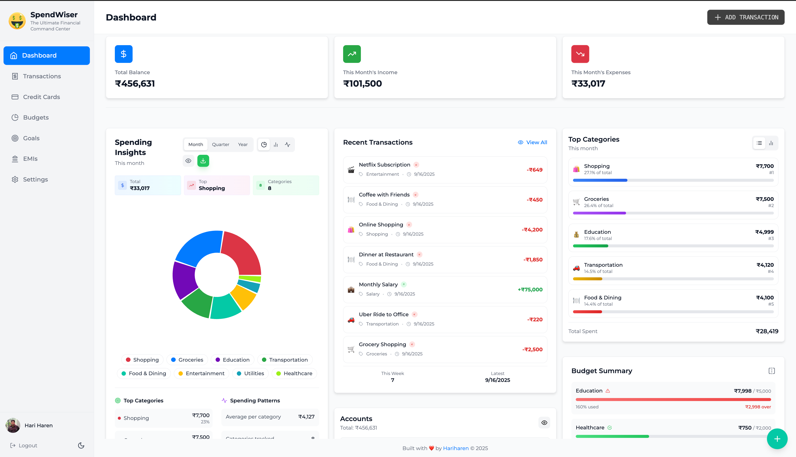
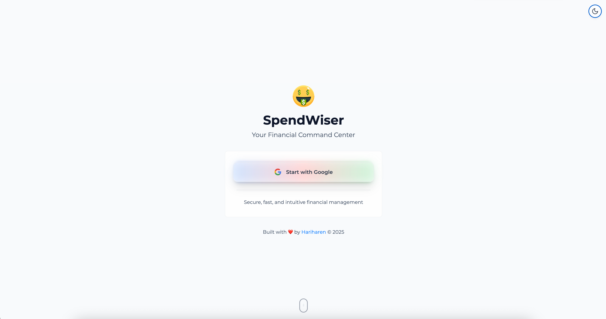

<div align="center">

  <h1>💸 SpendWiser</h1>
  
  <p>
    <strong>Your Ultimate Financial Command Center</strong><br>
    <em>From financial chaos to crystal clarity.</em>
  </p>
  
  <p>
    <a href="#">
      
    </a>
    <a href="https://github.com/hariharen9/spendwiser/stargazers">
      
    </a>
    <a href="https://github.com/hariharen9/spendwiser/blob/main/LICENSE">
      
    </a>
    <br>
    
    <a href="eslint.config.js">
        
    </a>
    <a href="#">
      
    </a>
  </p>
</div>

---

## 🌟 Why SpendWiser Will Revolutionize Your Finances

> *"SpendWiser isn't just an expense tracker. It's a complete financial command center that empowers you with the clarity and tools needed to master your money."*

<div align="center">
  
</div>

---

## 🏆 Core Features

<div align="center">
<table>
<tr>
<td width="45%">

### 💰 **Effortless Tracking & Goals**
**Automate, Track, and Achieve**
- **Effortless Expense Tracking:** Log every transaction with ease and intuitiveness. Categorize, tag, and add descriptions for a complete picture of your spending.
- **Automate Your Finances:** Set up **Recurring Transactions** for bills and subscriptions and never manually enter them again.
- **Turn Dreams into Reality:** Create **Financial Goals** and track your progress towards your next big purchase, vacation, or investment.
- **All Accounts in One Place:** Manage checking, savings, and credit card accounts seamlessly.
- **Easy Data Migration:** Full CSV import/export and secure JSON backup/restore.

</td>
<td width="45%">

### 🚀 **Financial Strategy & Analytics**
**Become Debt-Free Faster & Plan for the Future**
- **Loan Repayment Simulator:** Our interactive EMI calculator is a strategic tool to conquer debt. Model prepayments and extra EMIs to see exactly how much interest you'll save and how much sooner you can be debt-free.
- **At-a-Glance Command Center:** A fully customizable dashboard gives you a complete overview of your financial health.
- **Predict the Future:** See your projected cash flow and account balances to make smarter decisions.
- **Insightful Analytics:** Dive deep into your spending patterns with interactive charts and graphs.
- **Customizable Reports:** Generate detailed reports tailored to your needs.

</td>
</tr>
<tr>
<td width="45%">

### 🎯 **Intelligent Budgeting**
**Plan and Monitor with Precision**
- **Take Full Control:** Set category-based budgets or an overall monthly limit.
- **Stay on Track:** Visual progress bars and spending alerts notify you before you overspend.
- **Real-Time Clarity:** See your spending update instantly as you add transactions.
- **Smart Categorization:** Automatically categorize transactions with AI-powered suggestions.


</td>
<td width="45%">

### ✨ **A Modern UI You'll Love**
**An Experience Designed for Clarity & Speed**
- **Beautifully Responsive:** A seamless experience on desktop, tablet, and mobile.
- **Deeply Customizable:** Automatic Dark/Light mode and multiple font choices to fit your style.
- **Fluid & Fast:** Smooth animations and custom-built components make managing finances a pleasure, not a chore.
- **Intuitive Navigation:** A clean, user-friendly interface with easy-to-understand controls.

</td>
</tr>
</table>
</div>


## 📸 Featured

<table width="100%">
  <tr>
    <td width="33%" align="center">
      <b>Unified Dashboard</b><br><br>
      
    </td>
    <td width="33%" align="center">
      <b>Loan Repayment Simulator</b><br><br>
      
    </td>
    <td width="33%" align="center">
      <b>Transaction Management</b><br><br>
      
    </td>
  </tr>
  <tr>
    <td width="33%" align="center">
      <b>Intelligent Budgeting</b><br><br>
      
    </td>
    <td width="33%" align="center">
      <b>Financial Goals</b><br><br>
      
    </td>
    <td width="33%" align="center">
      <b>Deep Customization</b><br><br>
      
    </td>
  </tr>
</table>

## 📱 Mobile First Experience

SpendWiser is designed from the ground up to be a pleasure to use on any device. The mobile interface is clean, fast, and provides access to all the powerful features of the desktop app.

<table width="100%">
  <tr>
    <td width="33%" align="center">
      <b>Mobile Dashboard</b><br><br>
      
    </td>
    <td width="33%" align="center">
      <b>Mobile Transactions</b><br><br>
      
    </td>
    <td width="33%" align="center">
      <b>Filter & Sort</b><br><br>
      
    </td>
  </tr>
  <tr>
    <td width="33%" align="center">
      <b>Add Transaction</b><br><br>
      
    </td>
    <td width="33%" align="center">
      <b>Budgets on Mobile</b><br><br>
      
    </td>
    <td width="33%" align="center">
      <b>Goals on Mobile</b><br><br>
      
    </td>
  </tr>
</table>

---


## 📈 Competitive Advantage

| Feature                  | SpendWiser                               | Spreadsheets       | Other Trackers   |
| :----------------------- | :--------------------------------------- | :----------------- | :--------------- |
| **Dashboard**            | ✅ Fully Customizable & Interactive      | ❌ Manual setup     | ❓ Static         |
| **Loan Tracker/Adviser**      | ✅ Integrated & Powerful                 | ❌ Extremely complex | ⛔️ Not available  |
| **Analytics & Forecasts**| ✅ Integrated & Automated                | ❌ Complex formulas | ⛔️ Basic stats    |
| **Goal Setting**            | ✅ Integrated & Automated                | ❌ Complex formulas | ⛔️ Basic or not available    |
| **Credit Card Management** | ✅ Integrated & Automated                | ❌ Complex formulas | 🚫 Not available    |
| **Budgeting**            | ✅ Real-time & Visual                    | ❌ Manual tracking  | ✅ Basic lists     |
| **UI/UX**                | ✅ Modern, Responsive, Animated          | ❌ Utilitarian      | 🚫 Dated/Clunky   |
| **Mobile Experience**    | ✅ PWA & Mobile-First                    | ❌ Desktop only     | 🚫 Poor mobile    |

---

## 🤝 Contributing

We welcome contributors of all levels! If you're looking to help, please check the `CONTRIBUTING.md` file for guidelines.

### ⭐ Why Star This Repository?
If you find SpendWiser useful, please consider giving it a star! It's a simple way to show your appreciation and helps the project gain visibility in the community. More stars mean more contributors and a better tool for everyone. Thank you for your support!

<div align="center">

<p>
  <a href="https://github.com/hariharen9/spendwiser/issues">
    
  </a>
  <a href="https://github.com/hariharen9/spendwiser/pulls">
    
  </a>
</p>

</div>

---

## 🔧 Built with Modern Excellence

<div align="center">

<p>
  
  
  
  
  
  
</p>

</div>

SpendWiser is built with a focus on performance, real-time data synchronization, and a beautiful, accessible user experience.

---

## ⚡ Quick Start (For Developers)

1.  **Clone the repository:**
    ```bash
    git clone https://github.com/hariharen9/spendwiser.git
    cd spendwise/new-spendwise
    ```

2.  **Install dependencies:**
    ```bash
    npm install
    ```

3.  **Configure Firebase:**
    *   Create a `.env` file in the root directory (`cp .env.example .env`).
    *   Add your Firebase project configuration keys to the `.env` file.

4.  **Launch the app:**
    ```bash
    npm run dev
    ```

---

<div align="center">
  <p> If you find my work helpful, consider supporting me!</p>
  <p>
    <a href="https://www.buymeacoffee.com/hariharen" target="_blank"></a>
    <a href="https://paypal.me/thisishariharen" target="_blank"></a>
  </p>
</div>

---
<div align="center">

### **Ready to Master Your Finances?**

<p>
  <a href="#">
    
  </a>
</p>

---

<p>
  <strong>Built with ❤️ by</strong><br>
  <a href="https://hariharen9.site/">
    
  </a>
</p>

<p>
  <em>"Clarity in finance, confidence in life."</em>
</p>

</div>
