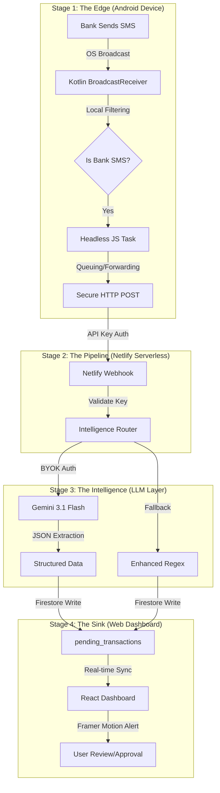

# 🚀 The Zero-Touch Pipeline: Architecting a Privacy-First, Autonomous Financial Ingestion System

## 1. Executive Summary: The Death of Manual Entry
The primary friction in personal finance management is the "Data Entry Tax." Most users abandon tracking apps within 30 days because manual logging is tedious, and automated banking aggregators (like Plaid) are either expensive, privacy-invasive, or unsupported in many regions.

**SpendWiser's SMS Automation** is a sophisticated, decoupled, and privacy-first engineering solution that eliminates this friction. It provides a **real-time, zero-touch data pipeline** that intercepts financial events at the source (the mobile OS) and delivers them to a web dashboard in seconds. This isn't just a feature; it's a **distributed systems architecture** that leverages Native Android APIs, Serverless Cloud Functions, and LLM-driven intelligence to provide enterprise-grade automation for $0.

---

## 2. The "Technical Loophole": Engineering Around the Sandbox
Modern mobile operating systems have built a "fortress" around user data, creating a massive barrier for web-based productivity tools:
- **PWA Restrictions:** Browsers are strictly prohibited from reading a user's SMS inbox for security reasons.
- **App Store Gatekeeping:** The Google Play Store heavily restricts apps requesting `RECEIVE_SMS` permissions, often rejecting any app where SMS isn't the "primary" purpose (e.g., a messaging app).

**The Architectural Masterstroke:** I bypassed these restrictions by designing a **Decoupled Serverless Sidecar**.
1.  **The Web App:** Remains a clean, cross-platform PWA hosted on Netlify.
2.  **The Listener:** A standalone, open-source Android APK that is **sideloaded** by the user. 
By moving the SMS capability into a sideloaded "bridge," we gain full access to the hardware-level broadcasts while keeping the main application uncluttered and platform-independent.

---

## 3. High-Level Architecture: The "Edge-to-Dashboard" Relay

The system operates as a four-stage distributed pipeline:

---

## 4. Deep Dive: Layer-by-Layer Engineering

### 4.1 The Native "Sidecar" (Kotlin + Headless JS)
The Android Listener is designed for **Extreme Battery Efficiency**. It uses an event-driven model rather than polling.
- **Native Interception:** A Kotlin `SmsBroadcastReceiver` registers for `Telephony.Sms.Intents.SMS_RECEIVED_ACTION`. It stays dormant until the exact millisecond an SMS arrives.
- **Local Privacy Filter:** Before waking up the Javascript engine, the Kotlin layer performs a "High-Pass" filter. It checks for currency symbols (`₹`, `Rs.`, `$`) and transaction keywords (`debited`, `spent`, `credited`). If it's a text from a friend, the app stays asleep.
- **Headless Task Service:** If the filter passes, it spawns an `SmsHeadlessTaskService`. This is a background React Native environment that runs without a UI, allowing the app to process data even if the phone is locked.

### 4.2 The Intelligence Layer: Multi-Tier LLM Fallback
Bank SMS messages are "unstructured noise." They vary wildly across 500+ global banks. Instead of writing 500 different regex rules, I built a **Resilient Intelligence Pipeline**:
1.  **Primary Engine:** `Gemini 3.1 Flash Lite Preview`. We use a specialized prompt to force the LLM to output pure JSON with keys: `amount`, `merchant`, `type` (income/expense).
2.  **Secondary Engine:** `Gemini 2.5 Flash`. If the Lite model fails or returns malformed JSON, the pipeline automatically retries with the higher-reasoning model.
3.  **The "Safety Net":** An **Enhanced Regex Engine** sits at the end. If the user is offline or the AI API is down, we use complex pattern matching to extract the amount and merchant, ensuring the transaction is never lost.

### 4.3 Data Sovereignty: The BYOK (Bring Your Own Key) Model
This is the pinnacle of the "Privacy-First" design.
- **Personal Vaults:** Users provide their own **Google Gemini API Key** and store it in their private Firestore profile.
- **Direct Pipeline:** The Netlify function pulls the *user's* key to talk to the AI.
- **Zero Exposure:** As the developer, I have zero visibility into the user's finances. The data flows from the User's Phone $\rightarrow$ User's Webhook $\rightarrow$ User's AI Key $\rightarrow$ User's Database.

---

## 5. Resilience & Edge-Case Handling: "Real World" Engineering
A system that only works when everything is perfect isn't a system—it's a demo. SpendWiser is built for the "Real World":

### 5.1 The Offline Queue (Persistence)
If you receive an SMS while your phone is in Airplane Mode or a dead zone:
- The Android app detects the network failure.
- It stores the SMS in `AsyncStorage` (a local key-value store).
- It registers a `BackgroundFetch` task that "wakes up" every minute to check for connectivity.
- Once online, it "flushes" the queue to the dashboard.

### 5.2 Real-Time Synchronization (Zero Refresh)
We use **Firestore Snapshots** to create a seamless "Native" feeling on the web.
- The Webhook writes to a `pending_transactions` sub-collection.
- The React App maintains an active WebSocket to that specific path.
- **Result:** You receive a bank SMS on your phone, and 2 seconds later, a notification banner slides down on your laptop screen automatically. No page refreshes required.

### 5.3 Duplicate Prevention
Some Android OEMs broadcast the same SMS intent twice. I implemented a **Content-Hashing Deduplication** layer. The system generates a hash of the raw SMS text and timestamp; if it sees the same hash within 60 seconds, it silently discards the duplicate.

---

## 6. Competitive Advantage: SpendWiser vs. The World

| Feature | SpendWiser | Traditional Apps (Plaid) | Spreadsheets |
| :--- | :--- | :--- | :--- |
| **Data Source** | Native SMS (Direct) | Third-Party API (Middleman) | Manual Entry |
| **Privacy** | **100% (On-Device/BYOK)** | Low (Requires Bank Login) | High (Manual) |
| **Cost** | **$0 (Forever)** | $5 - $15 / month | $0 |
| **Speed** | **Real-Time (Seconds)** | Delayed (Hours/Days) | Manual |
| **Global Support**| **Any bank with SMS** | Limited by API Region | Universal |

---

## 7. Security & Privacy Guarantees
- **On-Device Filtering:** Personal messages never leave your phone.
- **HTTPS Encrypted:** All data transit is protected by SSL.
- **Revocable Keys:** User-generated API keys can be instantly rotated or revoked from the dashboard.
- **Open Source:** Every line of the Listener's code is available for audit, ensuring no "backdoors" exist.

## Summary
SpendWiser's SMS integration is a masterclass in **Decoupled Architecture**. It demonstrates how to combine low-level Mobile OS APIs with high-level Cloud Intelligence to solve a complex user friction problem. By prioritizing **privacy, cost-efficiency, and resilience**, it transforms a simple tracking app into a **Fully Autonomous Financial Command Center.**
